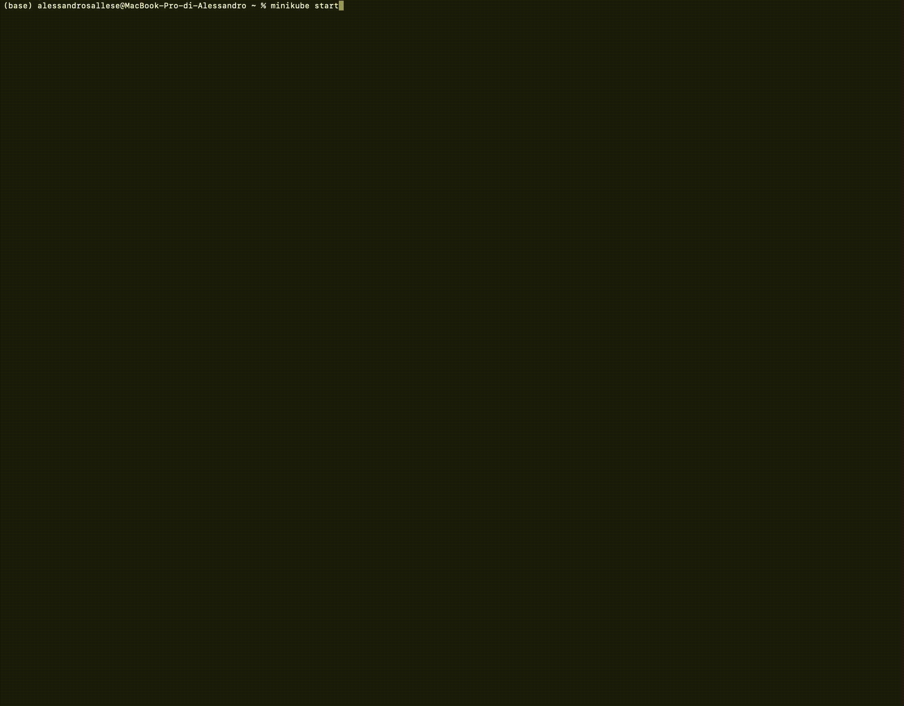
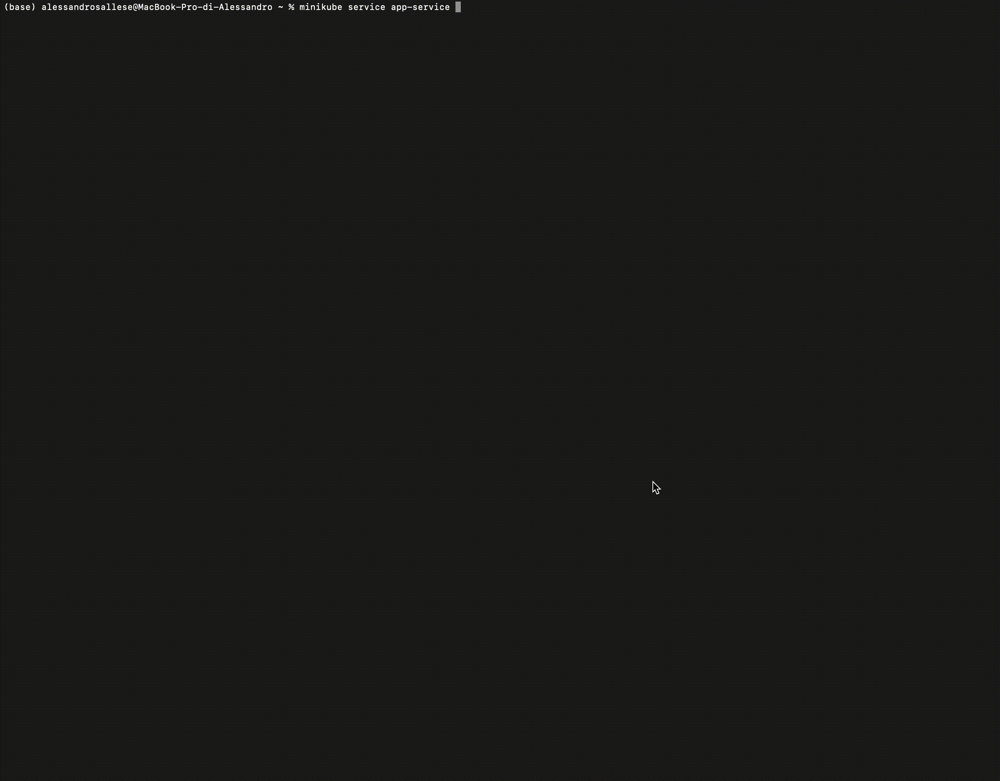
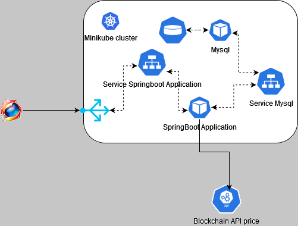

[](https://kubernetes.io/)
[](https://www.mysql.com/)
[](https://www.mysql.com/)
[](https://spring.io/projects/spring-boot)
[](https://minikube.sigs.k8s.io/docs/start/)
[](https://www.docker.com/)
[](https://maven.apache.org/)
[](https://www.java.com/)
[](https://www.thymeleaf.org/)

> It is an example of SpringBoot 3 application with thymeleaf engine deployed on Kubernetes. The application use an a Mysql database and we show how set the Kubernetes enviorement. For this example we use minikube for realize a cluster. This is an exercise and it is one way among many to develop this type of solution.


> [!NOTE]
> Every folder contain an explain of the project that it is inside.

# SpringbootWithKubernetes
<details>

<summary> <h4> Italian Info </h4> </summary>

## Deployment su Minikube (Italiano)

Questo documento descrive come effettuare il deploy dell'applicazione su Minikube utilizzando i file di configurazione di Kubernetes presenti nella directory `Kubernetes Configuration`.

### Prerequisiti

- [Minikube](https://minikube.sigs.k8s.io/docs/start/) installato e in esecuzione.
- [kubectl](https://kubernetes.io/docs/tasks/tools/install-kubectl/) Kubernetes installato.
- [Installer for Docker ](https://www.docker.com/products/kubernetes/)
- [Installer for Minikube ](https://minikube.sigs.k8s.io/docs/start/)
### Procedura di Deployment

1. Apri un terminale e naviga alla root del progetto.
2. Esegui il seguente comando avviare minikube ``` minikube start ``` 
3. Esegui il seguente comando per applicare la configurazione di Kubernetes:
   1. ``` kubectl apply -f Kubernetes\ Configuration ``` e il comando 
   2. ``` minikube service app-service ```
   

### Risultato 
#### Architecture 

#### Web Application in funzione 
L'applicazione permette di salvare nel database la propria cripto valuta con diverse info. 
Il servizio permett di avere la valuta aggiornata al prezzo attuale ad ogni aggiornamento della pagina home.

#### Spiegazione della configurazione di distribuzione 

</details>

<details>
<summary> <h4> English Info </h4></summary>

## Deployment on Minikube (English)
This document describes how to deploy the application on Minikube using the Kubernetes configuration files located in the Kubernetes Configuration directory.
### Prerequisites

- [Minikube](https://minikube.sigs.k8s.io/docs/start/)Minikube installed and running.
- [kubectl](https://kubernetes.io/docs/tasks/tools/install-kubectl/) Kubernetes installed.
- [Installer for Docker ](https://www.docker.com/products/kubernetes/)
- [Installer for Minikube ](https://minikube.sigs.k8s.io/docs/start/)
###  Deployment Procedure

  1. Open a terminal and navigate to the project root.
  2. Run the following command to start minikube ``` minikube start ``` 
  3. Run the following command to apply the Kubernetes configuration:
   1. ``` kubectl apply -f Kubernetes\ Configuration ``` e il comando ``` minikube service app-service ``` 

### Result
#### Web Application running
The application allows you to save your crypto currency in the database with different info. 
The service allows you to have the currency updated at the current price with each update of the home page.

#### Explain the deployment and SpringBoot configuration

</details>


