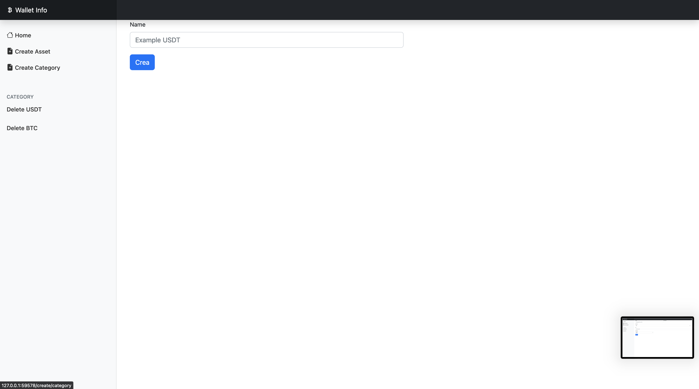

# SpringbootWithKubernetes

## Deployment su Minikube (Italiano)

Questo documento descrive come effettuare il deploy dell'applicazione su Minikube utilizzando i file di configurazione di Kubernetes presenti nella directory `Kubernetes Configuration`.

### Prerequisiti

- [Minikube](https://minikube.sigs.k8s.io/docs/start/) installato e in esecuzione.
- [kubectl](https://kubernetes.io/docs/tasks/tools/install-kubectl/) Kubernetes installato.

### Procedura di Deployment

1. Apri un terminale e naviga alla root del progetto.
2. Esegui il seguente comando per applicare la configurazione di Kubernetes:
   ``` kubectl apply -f Kubernetes\ Configuration ``` e il comando 
   ``` minikube service app-service ```

## Deployment on Minikube (English)
This document describes how to deploy the application on Minikube using the Kubernetes configuration files located in the Kubernetes Configuration directory.
### Prerequisites

- [Minikube](https://minikube.sigs.k8s.io/docs/start/)Minikube installed and running.
- [kubectl](https://kubernetes.io/docs/tasks/tools/install-kubectl/) Kubernetes installed.
###  Deployment Procedure

  1. Open a terminal and navigate to the project root.
  2. Run the following command to apply the Kubernetes configuration:
     ``` kubectl apply -f Kubernetes\ Configuration ``` e il comando
     ``` minikube service app-service ```
### Result




